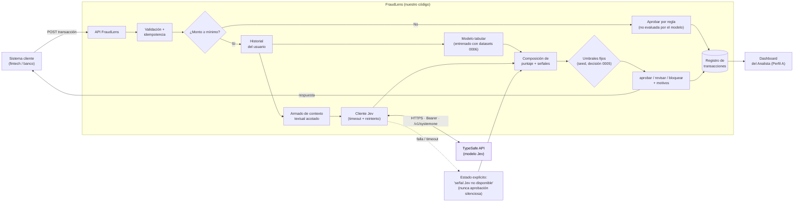
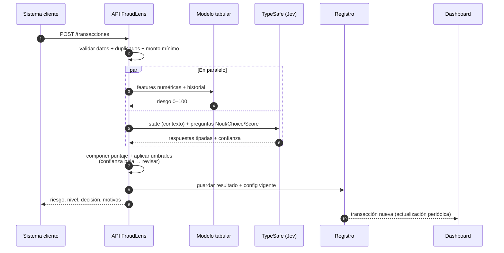

# TypeSafe AI (Jev) en FraudLens — investigación y arquitectura propuesta

| | |
|---|---|
| **Estado** | 🟡 **BORRADOR** — investigación + hipótesis de arquitectura. **No es una decisión del equipo.** |
| **Autor** | Mateo Diaz Valdez (MDV), con asistencia de Claude Code |
| **Fecha** | 2026-09-30 |
| **Tickets** | [Evaluar modelo de IA "Jev"](https://trello.com/c/yOSmUHOx) · [Modelos de IA a utilizar](https://trello.com/c/HgigLF8C) · [Conseguir acceso a la API](https://trello.com/c/mT2FcXyY) · [Completar el 6 Sombreros](https://trello.com/c/dNrC2EWY) · [Validar Jev con el dataset 3](https://trello.com/c/EYxcS7tu) |
| **Qué falta para ser definición** | Confirmar acceso a la API (§5) · 6 Sombreros con sombrero rojo del equipo (§7) · aprobación del equipo |

> ⚠️ **Cómo leer este documento (regla 6 del repo: distinguir fuentes).** Cada afirmación lleva su
> origen: 📗 **fuente oficial de TypeSafe** · 📙 **fuente secundaria** (terceros, sin verificar) ·
> 💡 **hipótesis nuestra / sugerencia de Claude**. Lo que no pudimos verificar está marcado ⬜.
> **Nada de la sección 4 (arquitectura) es una decisión**: es un punto de partida para discutir.

---

## 1. Qué es TypeSafe AI y qué es Jev

- 📗 **TypeSafe** construye un nuevo tipo de modelo de IA, **System One**, pensado para que lo use
  *software* (no personas en un chat). **Jev** es el primer modelo de esa clase.
  > *"Send Jev structured questions and get typed decisions with probabilities and confidence that
  > your software can act on."* — [typesafe.ai](https://typesafe.ai/)
- 📗 **No es un agente.** *"Does not generate code or choose its own next action"*. La filosofía:
  *"build a normal software workflow and insert System One only where AI is needed"* — el código
  controla el flujo y el modelo aparece sólo para juicios acotados sobre datos no estructurados.
  ([Cómo construir con System One](https://docs.typesafe.ai/concepts/how-to-build-with-system-one))
- 📗 **Entrada:** texto (`state`) + preguntas con un esquema definido de antemano.
  **Salida:** valores tipados con una **probabilidad calibrada** por respuesta, no texto libre.

> 💡 **Suposición a confirmar:** asumimos que el "TypeSafe AI" que tenías en mente es éste, y que
> es el mismo "Jev" de la tarjeta de Trello. Coincide con lo que dice la tarjeta.

### Los 3 tipos de pregunta (primitivas)

| Tipo | Qué devuelve | Ejemplo aplicado a fraude 💡 |
|---|---|---|
| **Noul** | Sí/No con confianza | ¿La descripción de la operación es inconsistente con el perfil del cliente? |
| **Choice** | Una opción de un **catálogo fijo** | ¿Cuál de estos motivos de riesgo aplica? (lista cerrada) |
| **Score** | Un puntaje en una escala **ordenada** | Severidad del caso: baja / media / alta / crítica |

📗 Reglas de diseño que da la documentación: las preguntas deben ser **atómicas y estrechas**; se
pasa sólo el contexto relevante; son **independientes y en paralelo** (no hay bucle de agente).

### Los 4 patrones oficiales

📗 [docs.typesafe.ai/patterns](https://docs.typesafe.ai/patterns) — la documentación sólo trae la
descripción de cada uno, sin código:

| Patrón | Para qué | Por qué nos interesa 💡 |
|---|---|---|
| **Confidence-Gated Routing** | Usar la confianza como segundo eje de decisión → sistemas más seguros | **El más relevante:** encaja con "revisar" cuando el sistema no está seguro |
| **Composite Scoring** | Combinar varias dimensiones en un único puntaje | Armar un puntaje de riesgo a partir de señales cualitativas |
| **Speculative Fan-Out** | Mandar muchas preguntas en una sola llamada y que el código elija cuáles importan | Ahorra costo/latencia: todas las señales en un request |
| **Intent Routing** | Clasificar la intención y derivar al handler correcto | Menos obvio para FraudLens |

---

## 2. Qué dice la documentación oficial sobre fraude

📗 [Casos de uso](https://docs.typesafe.ai/concepts/use-case-map) menciona **Financial Crime**:
*"Evaluate transaction narratives, KYC documents, and alert histories for suspicious
characteristics"*, con tres funciones: emparejar entidades entre registros inconsistentes,
priorizar riesgo por relevancia y calidad de evidencia, y **derivar casos ambiguos a un
investigador**. También menciona detección de indicios de fraude en reclamos de seguros.

⚠️ **Matiz importante:** TypeSafe **no se vende como plataforma antifraude**. Lo que ofrece es una
pieza para *interpretar texto y emitir juicios tipados*. La documentación da marcos generales, **no
esquemas concretos** para fraude.

---

## 3. Límites y riesgos — lo que hay que tener presente

| Tema | Qué se sabe | Fuente |
|---|---|---|
| **Acceso** | Early access **con lista de espera**; un único API hosteado. Sin pesos abiertos ni opción on-premise | 📙 [TrueFoundry](https://www.truefoundry.com/blog/typesafe-ai-jev) · 📗 typesafe.ai dice "early access" |
| **Precio** | **$42 por billón de tokens de entrada** (= $0,042 / millón). Salida: gratis según 📙 | 📗 typesafe.ai · 📙 TrueFoundry |
| **Latencia** | Declarada: 70–500 ms. **Auto-reportada**, sin verificación independiente | 📙 TrueFoundry |
| **Calibración** | Es la promesa más fuerte y, según 📙, *"no la testeó nadie por fuera"*. Los benchmarks son *"self-graded on a format the company invented"* | 📙 TrueFoundry |
| **Errores** | No genera texto libre, pero puede *"confidently pick the wrong one"* entre las opciones que le damos | 📙 TrueFoundry |
| **Cardinalidad** | Máx. 255 opciones por campo | 📙 TrueFoundry |
| **Privacidad / retención de datos** | ⬜ **No pudimos verificarlo.** El Trust Center ([trust.typesafe.ai](https://trust.typesafe.ai/)) no devolvió contenido legible y typesafe.ai no hace afirmaciones de privacidad en lo que leímos | ⬜ |
| **Límites de uso (rate limits)** | ⬜ No figuran en la documentación que leímos | ⬜ |
| **Versión de Python** | ⬜ No figura en lo que leímos del SDK | ⬜ |

> 💡 **Lo que esto implica para el proyecto:**
> 1. **Mandar datos de transacciones a una API de terceros** es una objeción obvia para un banco o
>    fintech (nuestro cliente, decisión 0004). Para el MVP con datasets públicos/sintéticos no
>    es un problema; **para el pitch hay que tener una respuesta** (¿qué retiene TypeSafe? ⬜).
> 2. **No tenemos evidencia independiente** de que sus probabilidades estén bien calibradas.
>    Habría que **medirlo nosotros** con los datasets etiquetados (ver §6).
> 3. Es **una dependencia externa cerrada** (sin on-premise). El requerimiento no funcional de ML
>    manda que *"los errores del modelo no deben producir aprobaciones silenciosas"*: si Jev cae,
>    hay que degradar de forma explícita.

---

## 4. Arquitectura propuesta 💡 (hipótesis, no decisión)

### 4.1 Dónde encaja Jev — y dónde NO

El MVP (requerimientos de ML, borrador) calcula un **puntaje 0–100** con un **modelo tabular
entrenado con datos históricos**, aplica umbrales fijos y devuelve *aprobar / revisar / bloquear*
+ hasta 3 motivos. Datasets: decisión [0006](../03-decisiones/0006-tres-datasets-para-el-modelo.md).

**Jev no reemplaza a ese modelo.** Jev interpreta **texto**; el dataset 1 (`nelgiriyewithana`) son
columnas **PCA anonimizadas** (`V1`…`V28`) sin texto que leer (ver [`datos.md`](datos.md)). El
clasificador tabular sigue siendo el núcleo del puntaje.

Donde Jev **podría** aportar (cada uno sujeto a validar en §6):

| # | Uso posible 💡 | Primitiva | Por qué podría servir | Riesgo |
|---|---|---|---|---|
| J1 | **Motivos legibles** para el analista: elegir del catálogo fijo de motivos de riesgo | Choice | Cubre "devolver los motivos" del CU-01 sin que el modelo invente texto | Depende de cuánto contexto textual le pasemos; dataset 3 sí trae comercio/categoría |
| J2 | **Señales cualitativas** ("monto atípico para este perfil", "comercio inusual para la categoría") | Noul | Convierte contexto semi-estructurado en señales tipadas | Puede ser redundante con el modelo tabular |
| J3 | **Puerta de confianza** hacia "revisar" cuando la confianza es baja | Confidence-Gated Routing | Es el patrón oficial más alineado con el flujo aprobar/revisar/bloquear | Calibración no verificada por terceros |
| J4 | **Priorizar la cola** del analista por severidad | Score | Ayuda al Perfil A a empezar por lo más grave | Es una función de valor agregado, no del MVP mínimo |

> 💡 **Regla de diseño que propongo:** Jev **sólo aporta señales**; **la decisión final la toma el
> código determinístico** (umbrales). Coincide con la filosofía oficial de System One y con "el
> modelo asiste, no reemplaza el criterio del analista" (Árbol de Problemas, [`problema.md`](problema.md)).

### 4.2 Diagrama de componentes



### 4.3 Diagrama de secuencia de una evaluación



### 4.4 Contrato de llamada a Jev

📗 **Verificado en la documentación oficial** ([quickstart](https://docs.typesafe.ai/introduction/quickstart)):

- Endpoint: `POST https://api.typesafe.ai/v1/systemone`
- Headers: `Authorization: Bearer <API_KEY>` · `Content-Type: application/json`
- Clave de API: [console.typesafe.ai/keys](https://console.typesafe.ai/keys) · Playground:
  [console.typesafe.ai/playground](https://console.typesafe.ai/playground) (requiere login)
- Cuerpo: `state` (texto), `model` (p. ej. `"jev-latest"`), `questions` (objeto con `type`
  `noul|choice|score`, `instructions`, `criteria`)
- Respuesta: `model` (p. ej. `jev-1.13.0`), `answers` con `confidence` y `probabilities` por
  pregunta, y `usage` (tokens de entrada/salida)

📗 **SDK oficial de Python** ([repo](https://github.com/typesafe-ai/typesafe-sdk-python), licencia
MIT): `pip install typesafe-sdk` (o `uv add typesafe-sdk`), clientes `TypeSafeClient` y
`AsyncTypeSafeClient`, variable de entorno `TYPESAFE_API_KEY`, método `system_one(state=…, questions=…)`;
se lee con `response.nouls[k].noul`, `response.choices[k].choice`, `response.scores[k].score`.

💡 **Ejemplo de preguntas para FraudLens** — *armado por Claude, NO probado contra la API*
(no tenemos clave; el esquema de `criteria` hay que validarlo contra la documentación completa en
`/sdk/python/usage` antes de usarlo):

```jsonc
{
  "state": "Compra de ARS 480.000 en comercio categoría 'electrónica', 03:12 hs, país distinto al habitual, dispositivo nuevo.",
  "model": "jev-latest",
  "questions": {
    "monto_atipico":  { "type": "noul",   "instructions": "¿El monto es atípico para este perfil?" },
    "motivo_riesgo":  { "type": "choice", "instructions": "¿Cuál es el principal motivo de riesgo?",
                        "criteria": { "monto": "…", "ubicacion": "…", "horario": "…", "dispositivo": "…", "ninguno": "…" } },
    "severidad":      { "type": "score",  "instructions": "Severidad del caso",
                        "criteria": ["baja", "media", "alta", "critica"] }
  }
}
```

---

## 5. Lo que bloquea avanzar hoy

| # | Bloqueo | Quién | Cómo se destraba |
|---|---|---|---|
| B1 | ¿Tenemos **acceso a la API** (clave)? El acceso es por lista de espera 📙 | MDV | Entrar a [console.typesafe.ai](https://console.typesafe.ai/keys) y ver si hay clave o se pide acceso. ⬜ **No sabemos si ya se anotó alguien** |
| B2 | **Repositorio de código del MVP** no existe | ML (tarjeta "Arrancar el repositorio de código del MVP") | [P-05](../00-proyecto/preguntas-abiertas.md#p-05) — arranca el 7/10 según el cronograma |
| B3 | **Stack sin definir** | Equipo | [P-10](../00-proyecto/preguntas-abiertas.md#p-10). Ojo: hay SDK oficial de Python y de .NET; **si el backend no es Python, se usa REST directo** |
| B4 | **Mapeo de datasets** a requerimientos sin hacer | FGR | [`datos.md`](datos.md) — define qué texto/contexto podríamos pasarle a Jev |

---

## 6. Cómo validaríamos que Jev sirve (antes de depender de él)

💡 Propuesta de spike chico, **no construir más que esto hasta pasar las pruebas**:

1. **Conseguir clave** y probar 3–5 preguntas en el [Playground](https://console.typesafe.ai/playground).
2. Tomar una muestra del **dataset 3** (`kartik2112`, sintético, trae comercio/categoría/monto) y
   renderizar cada fila como texto corto para `state`.
3. Medir contra la etiqueta real (`fraude / no fraude`): ¿las señales de Jev **agregan** algo
   sobre el modelo tabular solo? ¿La confianza **está calibrada** (las respuestas con 90% de
   confianza aciertan ~90%)? Es la promesa que 📙 dice que nadie verificó.
4. Comparar **costo y latencia reales** contra lo declarado (70–500 ms; $0,042 / MTok).
5. **Criterio de corte:** si Jev no agrega señal medible o la calibración falla, **se descarta** y
   queda documentado como hallazgo — eso también vale para la nota de *innovación tecnológica*.

> 🎓 **Honestidad académica** (ver [`prototipo.md`](prototipo.md)): todo código que generemos con IA
> para esto se declara en [`declaracion-uso-ia.md`](../00-proyecto/declaracion-uso-ia.md) y cada
> integrante tiene que poder explicarlo en The Pitch.

---

## 7. ¿Es una decisión? → Falta el 6 Sombreros

Usar Jev implica **elegir un modelo de IA y una dependencia externa**: es una decisión de las que
se pueden hacer mal de más de una manera (criterio del repo, decisión
[0003](../03-decisiones/0003-metodo-seis-sombreros.md)). Antes de adoptarlo hay que escribir
[`analisis/6-sombreros-jev.md`](analisis/6-sombreros-jev.md) — **ya hay un borrador**:

- ⚪ **Blanco (hechos):** lo de este documento. Faltantes: ⬜ acceso, ⬜ privacidad, ⬜ rate limits.
- 🔴 **Rojo:** lo escribe **el equipo**, no la IA. Está vacío a propósito.
- ⚫🟡🟢 **Negro, amarillo, verde:** borrador de Claude Code para que el equipo corrija.
- 🔵 **Azul:** sin decidir.

**Preguntas abiertas** (ya cargadas en [`preguntas-abiertas.md`](../00-proyecto/preguntas-abiertas.md)):

- [P-25](../00-proyecto/preguntas-abiertas.md#p-25) — ¿Tenemos o podemos conseguir **acceso a la API de TypeSafe**? ¿Quién se anota?
- [P-26](../00-proyecto/preguntas-abiertas.md#p-26) — ¿Qué **retiene** TypeSafe de los datos que recibe y se usan para entrenar? (relevante para el cliente fintech/banco)
- [P-27](../00-proyecto/preguntas-abiertas.md#p-27) — ¿Qué texto/contexto **realmente tenemos** para pasarle a Jev dado el dataset elegido?

---

## Fuentes

**📗 Oficiales (TypeSafe)** — consultadas el 2026-09-30:
- [typesafe.ai](https://typesafe.ai/) — descripción de Jev, precio, estado "early access"
- [docs.typesafe.ai — Quick start](https://docs.typesafe.ai/introduction/quickstart) — endpoint, auth, formato
- [docs.typesafe.ai — Cómo construir con System One](https://docs.typesafe.ai/concepts/how-to-build-with-system-one)
- [docs.typesafe.ai — Patrones](https://docs.typesafe.ai/patterns)
- [docs.typesafe.ai — Casos de uso](https://docs.typesafe.ai/concepts/use-case-map)
- [docs.typesafe.ai — SDK de Python](https://docs.typesafe.ai/sdk/python) · [repo oficial](https://github.com/typesafe-ai/typesafe-sdk-python)

**📙 Secundarias (terceros — no son TypeSafe, tomar con cautela):**
- [TrueFoundry — "TypeSafe AI's Jev: What System One Models Actually Are"](https://www.truefoundry.com/blog/typesafe-ai-jev) — origen de: lista de espera, latencia, críticas a la calibración
- Otras que aparecieron y **no se leyeron**: [The Rundown](https://www.therundown.ai/news/typesafe-jev-ai-decisions-software), [Flavio Copes](https://flaviocopes.com/jev/)

**⬜ No se pudieron leer:** [Trust Center](https://trust.typesafe.ai/) · página de privacidad · referencia completa de la API · `/sdk/python/usage`.
